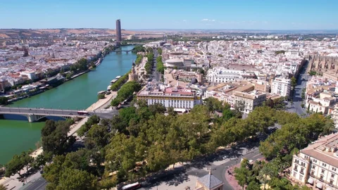

# 1. Análisis del sector tecnológico

### Contexto actual en Andalucía y Sevilla

El sector tecnológico en Andalucia, y en concreto en Sevilla, es un motor económico clave, la gran parte de la actividad se encuentra alojada en el Parque Científico y Tecnología Cartua (llamado PCT Cartuja). Está en constante crecimiento, albergando una gran alta densidad de empresas tecnologicas (TIC), que van aumentando su facturación y contratación en los últimos años, de esta manera consolidando a la provincia como referente en innovación digital a nivel nacional.

Además de las compañías grandes, hay una tendencia clara a digitalizar pequeñas y medianas empresas (PYMES) locales. Muchas de estas empresas tienen una infraestructura informática antigua y necesitan modernizarla urgentemente para adaptarse al teletrabajo o a los servicios en la nube. Esta transformación ha creado esa necesidad de renovar equipos y asegurar las comunicaciones, convirtiendo a la tecnología en un requisito de supervivencia para los negocios sevillanos, y no en una simple ventaja más.

### Oportunidades y tendencias para el perfil ASIR

> De esta manera, el perfil del Técnico Superior en Administración de Sistemas Informáticos en Red (ASIR), es fundamental para garantizar la continuidad de un negocio. Realmente si hay una gran demanda real de profesionales que estén capacitados para administrar **servidores**, que aseguren las **redes locales** y que gestionen servicios en la **nube**. Las empresas necesitan técnicos que no sólo implementen la tecnología, sino que se aseguren de la disponibilidad de los sistemas, sepan gestionar copias de seguridad y protejan los datos corporativos frente a incidencias inminentes o posibles.
