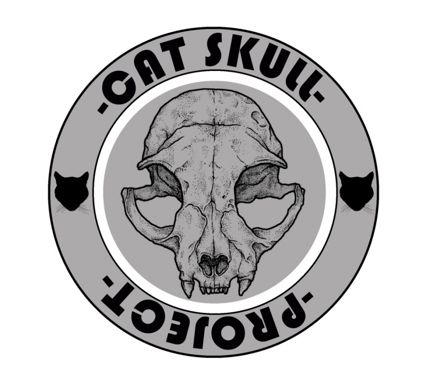

#  3. Identificación de necesidades tecnológicas

 

 

Para mi posible proyecto **(Cat Skull Project)**, he detectado necesidades importantes que comprometen tanto la seguridad de la propiedad intelectual y su capacidad de crecimiento comercial. Actualmente, la editorial no tiene una infraestructura centralizada, lo que hace que tenga una gestion manual de usuarios ineficiente y expone los archivos de los cómics, dibujos, prints, etc, a pérdidas por falta de copias de seguridad automatizadas y segmentación de red. De esta manera al no existir un sistema de monitorización impide conocer el estado real de los servidores, lo que hace que haya un nivel de riesgo operativo alto ante posibles caídas del servicio durante la actividad de ventas online.

---

> Mi solución técnica integral y propia de un técnico superior de ASIR, se basa en el despliegue de una arquitectura 100% Open Source que cubra estas necesidades de forma intermodular. Se añadirá Caddy como servidor web moderno y seguro (con gestión automática de HTTPS) para alojar la tienda online, respaldado por MariaDB para su base de datos y OpenLDAP para la autenticación de los empleados. En la infraestructura también incluirá NextCloud para tener un servicio en la nube, protegida perimetralmente por un firewall (IPFire) que está basado en Linux y supervisada en tiempo real por Zabbix, de esta manera teniendo el control total sobre el rendimiento y la seguridad de todo este entorno.
