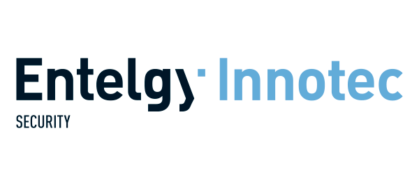
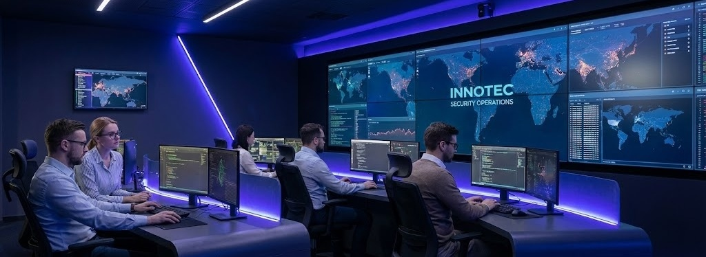
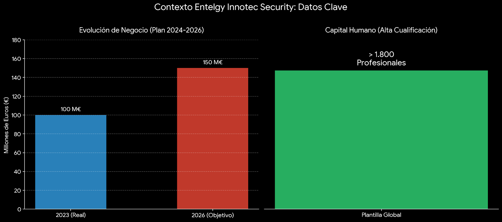

[Volver al índice general](../README.md)

# UD1 – Análisis del entorno y detección de necesidades tecnológicas

## Índice de apartados

- [ ] **1. Análisis del sector tecnológico**

 

### Contexto actual en Andalucía y Sevilla

El sector tecnológico en **Andalucía**, y especialmente en **Sevilla**, actualmente funcionan como el gran motor de la economía regional. Su actividad se encuentra en el *Parque Científico y Tecnológico Cartuja* (también llamado PCT Cartuja), un entorno que no para de crecer. Las cifras hablan por sí solas: contiene a **557 empresas** y da empleo a **29.538 personas**. Su impacto es demasiado grande, facturando de esta manera el último año unos **4.850 millones de euros** (cerca del 10% del PIB provincial), haciendo que sevilla sea una gran referente digital a nivel nacional.

Más allá de grandes multinacionales, también existe una realidad clara, en las **pequeñas y medianas empresas (PYMES)** locales. Gran parte de este tejido empresarial cuenta con muchos equipos informñaticos anticuados y necesitan de modernizar con urgencia para así adaptarse al teletrabajo o a los servicios en la nube. Para estas empresas, actualizar su tecnología y asegurar las comunicaciones ha dejado de ser una opción para convertirse en un requisito de supervivencia en el mercado actual.

---

 

 

### Oportunidades y tendencias para el perfil ASIR

> Ante esta escena, el perfil de **Técnico Superior en Administración de Sistemas Informáticos en Red (ASIR)** tiene una proyección laboral excelente. Con tantas empresas dependiendo de su infraestructura digital, realmente si existe una gran demanda real de profesionales cualificados para poder administrar **servidores**, poder desplegar **redes locales** seguras y poder gestionar la **nube**. El mercado no solo busca a alguien que instale equipos, sino a técnicos que sean capaces de garantizar que el sistema no falle, gestionar copias de seguridad y proteger los datos de la empresa/corporativos.

---
### Diagramas

 

 

> - **Gráfica 1 (Crecimiento de Facturación):** Esta gráfica nos enseña cómo ha subido el dinero que mueven las empresas de Cartuja de un año al otro.

> - **Gráfica 2 (Impacto Ecnonómico):** Esta gráfica nos enseña el 10% del PIB del que hemos hablado arriba.

> - **Gráfica 3 (Peso Tecnológico):** Esta gráfica nos enseña que casi el 60% de la actividad es Tecnología Avanzada, demostrando que sí hacen falta informáticos.

- [ ] **2. Selección de la empresa o contexto de trabajo**

 

### Empresa Seleccionada: Entelgy Innotec Security

He elegido esta empresa ya que es la principal compañía de ciberseguridad en España, con sede estratégica en **Sevilla** (Av. de la Buhaira). Respaldada por el Grupo Entelgy, que cerró en 2023 con una facturación de **100 millones de euros** y ejecuta un Plan Estratégico (2024-2026) para poder llegar a los **150 millones de euros**, la organización cuenta con más de **1.800 profesionales**. Este entorno es perfecto para un proyecto ASIR, básicamente por su criticidad técnica, protege activos del IBEX-35 y administración pública, de esta manera ofrecen un escenario real donde la disponibilidad y confidencialidad de los datos son lo más importante de todo.

---

 

La estructura operativa de esta empresa, se centra básicamente en el **SmartSOC** (Centro de Operaciones de Seguridad Inteligente) el cuál está disponible siempre, es apoyado por divisiones especializadas de **Red Team** (ofensiva) y **Blue Team** (defensa). Por decirlo así y entenderlo mejor, es cómo un ecosistema, la administración de sistemas es el núcleo del negocio. Se gestionan arquitecturas complejas cómo **SIEM (sistema que centraliza y analiza logs de la red para detectar amenazas)**, orquestadores **SOAR(plataforma que automatiza respuestas ante incidentes, bloquea ip atacante sin ayuda de una persona)** y firewalls de última y nueva generación. esta dependencia tecnológica hace que se puedan detectar necesidades reales para el proyecto, como la automatización de respuestas, gestion de identidades (IAM) y la fortificación de servidores, de esta manera cumpliendo lo que se pide en el proyecto de clase.

---

### Diagramas

 

 

> **Gráfica 1 (Objetivo de Negocio | Plan Estratégico):** esta gráfica nos enseña el crecimiento oficial desde el cierre de 2023 hasta el objetivo de 2026.

> **Gráfica 2 (Capital Humano):** esta gráfica nos enseña la fuerza laboral actual que sustenta el proyecto.

- [ ] **3. Identificación de necesidades tecnológicas**

### 3. Identificación de necesidades tecnológicas (Específico Entelgy)

A pesar de ser una emppresa grande y avanzada, tienen un elevado volumen de malware bancario y ransomware que el smarSOC debe de analizar mensualmente (unas 5.000 muestras) esto genera un cuello de botella en los procesos de análisis manual. Los analistas de Innotec requieren necesitan entornos de ejecución aislados (sandboxes) que nos permitirán detonas esas amenazas de forma segura para observar su comportamiento sin rieso de propagación lateral a la red corporativa o de fuga de datos confidenciales de los clientes fijos hacia nubes públicas de análisis (como VirusTotal, por ejemplo).

Desde la perspectiva de los sistemas (ASIR), he detectado la necesidad de implementar una infraestructura de "Malware Lab" automatizado y on-premise (local). Actualmente, la creación y restablecimiento de máquinas virtuales para cada análisis forense consume tiempo valioso de los operadores y recursos de un sistema. Se necesita una solución que orqueste automáticamente la creación de entornos efímeros (Windows/Linux), que capture el tráfico de red y vuelque la memoria RAM para su análisis, de esta manera garantizando que todo el proceso pase dentro de una red estancada (VLAN aislada) que cumpla con la normativa de "información clasificada" que maneja esta empresa que he elegido.

- [ ] **4. Oportunidades y viabilidad del proyecto**
- [ ] **5. Obligaciones legales y normativas**
- [ ] **6. Guion inicial del proyecto**

## Enlaces a recursos de la unidad

- [Documentos de la unidad](./documentos/)
- [Diagramas e imágenes](./img/)

  ## Bibliografía / Webgrafía 
- Autor1, Título del libro o artículo, Editorial/Año.
- Sitio web oficial: [Enlace](https://www.ejemplo.com)
- Tutoriales y guías recomendadas: [Enlace](https://www.ejemplo2.com)

